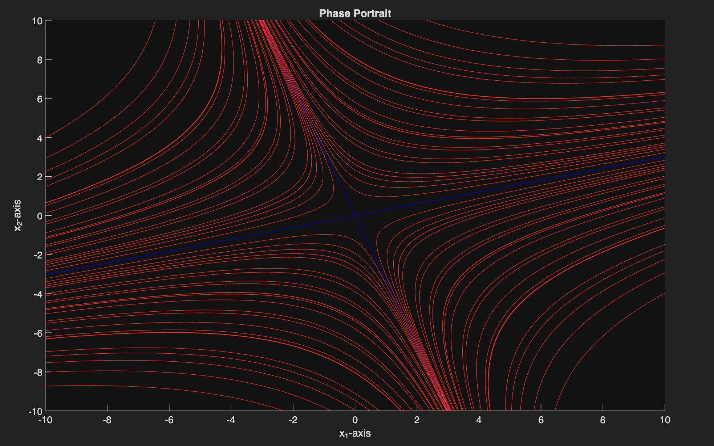
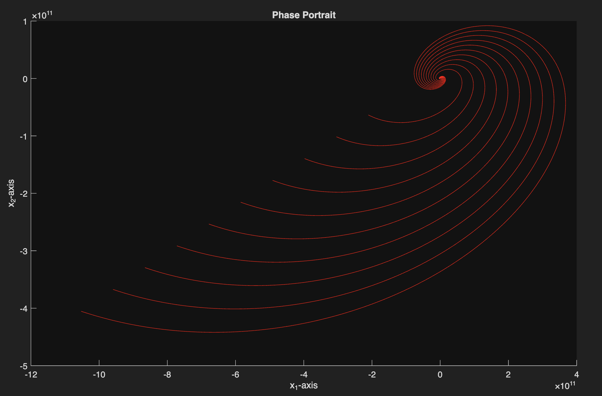

# phaseHunter
MATLAB tool for generating phase portraits of 2D linear homogeneous dynamical systems with constant coefficients.

Version 1.1: Added compatibility for shifted systems, as well as an optional centering feature on graphs (see Basic Function Usage section for more details).

# Overview

This project provides a MATLAB function for visualizing the phase portraits of 2D linear systems of the form $$\mathbf{x}' = \mathbf{Ax}$$, where $$\mathbf{A}$$ is a 2x2 constant coefficient matrix.

Phase portraits provide a geometric insight into stability and long-term behavior that is often difficult to see from equations alone.

The tool computes eigenvalues and eigenvectors, classifies equilibrium behavior, and generates solution trajectories illustrating the qualitative dynamics of the system.

This function was developed as an independent project as part of my study of differential equations and dynamical systems.

# Features

Generates phase portraits for 2D linear homogeneous systems

Automatically classifies equilibrium types:

  * saddle

  * stable node

  * unstable node

  * spiral sink/source

  * center

  * degenerate cases (zero eigenvalues)

Handles:

  * real distinct eigenvalues

  * complex conjugate eigenvalues

  * repeated eigenvalues

  * degenerate and defective matrices

  * shifted systems

Plots eigenvector solutions and critical lines

Returns a text description of system behavior

Input parameters can be customized to display single or multiple solutions across varying time intervals and initial conditions

# Example Phase Portraits and Demo

Below are some examples of phase portraits I have generated with this function. I have uploaded more example portraits and a demo script to demonstrate some of the function's capabilities, which can be found in the main repository.

| Saddle | Spiral Source |
|--------|-------------|
|  |  |

## Quick Start

1. Download or clone the repository

2. Add the folder to your MATLAB path

3. Run the function with your chosen input parameters

# Basic Function Usage

direction = phaseHunter(coeffMatrix, c1Interval, c2Interval, numCoeffs, shiftVec, timeInterval, xLims, yLims, isCentered)

Inputs:

* coeffMatrix: A 2x2 coefficient matrix

* c1Interval: Range for coefficient c1

* c2Interval: Range for coefficient c2

* numCoeffs: The number of unique trajectories

* timeInterval: Time range

* xLims: x-axis viewing window (optional)

* yLims: y-axis viewing window (optional)

Post v 1.1:

* shiftVec: A 2x1 column vector specifying how to shift the phase portrait

* isCentered: A double (1 or 0) specifying whether to center the view of the graph on the shifted node (optional but useful for shifted systems)

Outputs:

* direction: a text description of the type and long-term behavior of the system

* Plot of phase portrait

Example (no shift): direction = phaseHunter([5 -4; 5 -3], [-10 10], [-10 10], 10, [-5,5], [], [-10 10], [-10 10], 0)

Example (shift, not centered): direction = phaseHunter([5 -4; 5 -3], [-10 10], [-10 10], 10, [-5,5], [1;1], [-10 10], [-10 10], 0)

Example (shift, centered): direction = phaseHunter([5 -4; 5 -3], [-10 10], [-10 10], 10, [-5,5], [], [-10 10], [-10 10], 1)

Note: using the empty vector for xLims and yLims will not impose any limits on the viewing window. For some portraits, such as spirals, this may be preferable, however, others will likely require some viewing limits for best results.

## Mathematical Background

The behavior of the system is determined by the eigenvalues of the coefficient matrix:

* Real eigenvalues with opposite signs &rarr; saddle

* Real negative eigenvalues &rarr; stable node

* Real positive eigenvalues &rarr; unstable node

* Complex eigenvalues &rarr; spiral behavior

* Pure imaginary eigenvalues &rarr; center

* Zero eigenvalues &rarr; degenerate equilibrium

For example, the solution structure for systems with real, distinct eigenvalues typically follows:

$$
\mathbf{x}(t) = c_1 e^{\lambda_1 t}\mathbf{v}_1 + c_2 e^{\lambda_2 t}\mathbf{v}_2
$$

Or for shifted systems:

$$
\mathbf{x}(t) = c_1 e^{\lambda_1 t}\mathbf{v}_1 + c_2 e^{\lambda_2 t}\mathbf{v}_2 + a
$$

where $$a$$ is the shift vector

Modifications can be made for repeated eigenvalues, complex eigenvalues, etc.

## Project Motivation

I built this tool to better visualize and understand the qualitative behavior of linear dynamical systems while studying differential equations.

Developing this function also helped reinforce concepts such as:

* eigenvalue classification of equilibria

* generalized eigenvectors

* stability analysis

* visualization of dynamical systems

I learned a lot about linear systems by building this function, and I encourage the user to play around with it and experiment with different types of linear systems and inputs. My hope is that I can bring the same understanding I now have of linear systems to others with this function.
